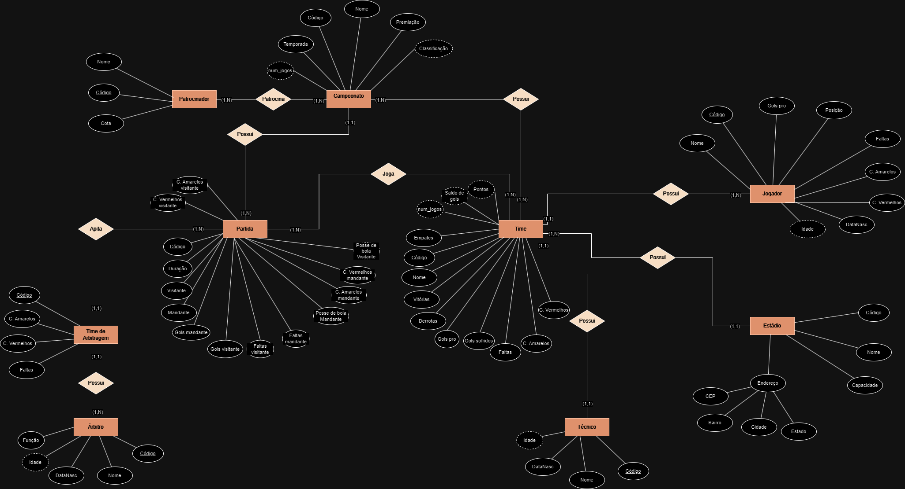
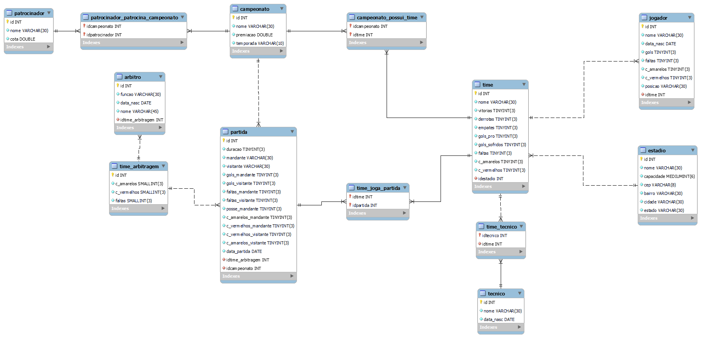

# db-campeonato
Um banco de dados relacional projetado para guardar informações de campeonatos de futebol.

## Primeiros passos

Para rodar este projeto localmente, siga os passos abaixo:

1. **Clone este repositório:**
    - ```git clone https://github.com/Joao-Vitor-Siqueira/db-campeonato.git```
2. **Navegue até o diretório do projeto:**
    - ```cd db-campeonato```
3. **Execute o arquivo database.sql em uma ferramenta de gerenciamento de banco de dados relacionais**

## Scripts

- **database.sql**: Criação das tabelas.
- **manipulation.sql**: Povoamento das tabelas.
- **queries.sql**: Consultas a serem realizadas.
- **routines.sql**: Rotinas armazenadas.
- **transactions.sql**: Transações a serem realizadas.
- **control.sql**: Controle de acesso de usuários.

## Análise de requisitos


| Campeonato |  |
| :---- | :---- |
| Dados | Código, Nome, Premiação, Número de jogos, ano, Classificação |
| Descrição | Todo **Campeonato** possui **Patrocinadores,** Todo **Campeonato** possui **Partidas,** Todo **Campeonato** possui **Times** |

| Time |  |
| :---- | :---- |
| Dados | Código, Nome, Vitórias, Derrotas, Empates, Gols pró, Gols sofridos, Faltas, C. Amarelos, C. Vermelhos, Número de jogos, Pontos, Saldo de gols |
| Descrição | Todo **Time** possui um **Estádio,** Todo **Time** possui **Jogadores,** Todo **Time** possui um **Técnico,** Todo **Time** pertence a pelo menos um **Campeonato,** Todo **Time** pertence a pelo menos uma **Partida** |

| Partida |  |
| :---- | :---- |
| Dados | Código, Duração, Mandante , Visitante , Gols mandante , Gols visitante, Faltas Mandante, Faltas Visitante, Posse de bola Mandante , Cartões Amarelos mandante, Cartões Vermelhos mandante, Cartões Amarelos visitante, Cartões Vermelhos visitante |
| Descrição | Toda **Partida** possui um **Time de arbitragem,** Toda **Partida** possui dois **Times,** Toda **Partida** pertence a um **Campeonato**  |

| Estádio |  |
| :---- | :---- |
| Dados | Código, Nome, Capacidade , Endereço |
| Descrição | Todo **Estádio** pertence a um ou mais **Times**  |

| Técnico |  |
| :---- | :---- |
| Dados | Código,nome,dataNasc |
| Descrição | Todo  **Técnico** pertence a um **Time** |

| Jogador |  |
| :---- | :---- |
| Dados | Código, Nome , DataNasc, Posição , Cartões Amarelos , Cartões Vermelhos,Número de gols, Faltas |
| Descrição | Todo **Jogador** pertence a um **Time** |

| Time de arbitragem |  |
| :---- | :---- |
| Dados | Código, C. Amarelos, C. Vermelhos, Faltas |
| Descrição | Todo **Time de arbitragem** pertence a pelo menos uma **Partida,**  Todo **Time de arbitragem** possui **Árbitros** |

| Árbitro |  |
| :---- | :---- |
| Dados | Código,nome,dataNasc,Função |
| Descrição | Todo **Árbitro** pertence a um **Time de arbitragem** |

| Patrocinador |  |
| :---- | :---- |
| Dados | Código, Nome , Cota |
| Descrição | Todo **Patrocinador** pertence a pelo menos um **Campeonato** |


## Modelagem conceitual


## Modelo lógico

